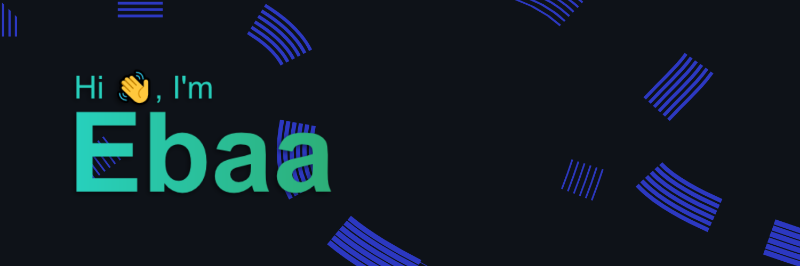

------------
<!--   -->
<!--  -->

Hey, Welcome to my page!\
My name is Ebaa, and I'm a self-taught developer who constantly starts side projects that never get finished 🐱‍💻

### Where to find me

<!--  -->

