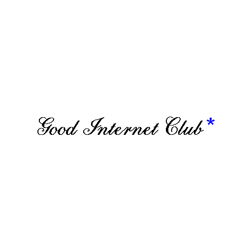

 

  <picture>
    <source media="(prefers-color-scheme: dark)" srcset="images/gic-anim-light.svg">
    <source media="(prefers-color-scheme: light)" srcset="images/gic-anim-dark.svg">
    
  </picture>

 

I'm Ebaa - self-taught full-stack engineer, currently building the core product at a stealth startup. 
I also direct Good Internet Club *, a curated studio that ships beautiful, 
thoughtful internet products for creators, communities, and businesses.

 

  <a href="https://ebaa.md">
    <picture>
      <source media="(prefers-color-scheme: dark)" srcset="images/links-light.svg">
      <source media="(prefers-color-scheme: light)" srcset="images/links-dark.svg">
      
    </picture>
  </a>

